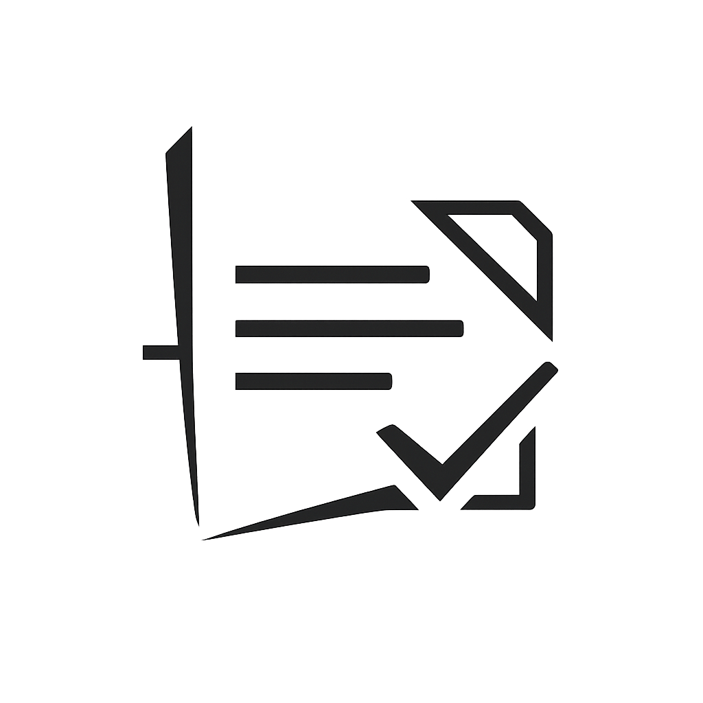
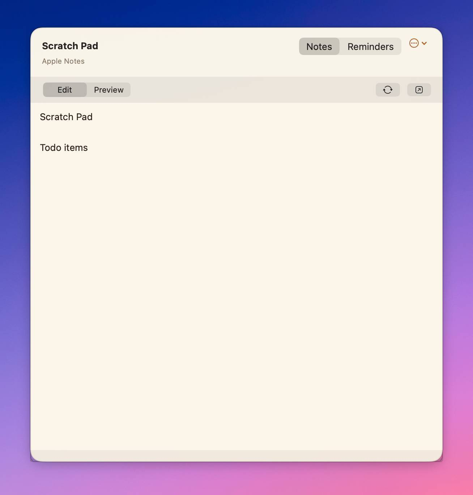

<p align="center">
  
</p>

<h1 align="center">EdgeNoted</h1>

A lightweight, always-available macOS companion for your **Apple Notes** and
**Apple Reminders**. EdgeNoted slides in from the edge of your screen, lets you
view and edit a single note instantly, and hides again — no app switching.

<p align="center">
  
</p>

## What it does

- **Always-on-top edge panel.** Slides in from the left, right, or bottom edge
  and stays above other apps, full-screen apps, and Stage Manager
  (`.fullScreenAuxiliary` window behavior).
- **Three ways to invoke it.**
  - Global keyboard shortcut (default `⌃⇧N`, configurable)
  - Click the thin "Open Bar" strip at the screen edge
  - Hot Side: touch the chosen screen edge with the mouse
- **Apple Notes, one-way writes (pull on demand).** EdgeNoted does not store
  your notes. It lists your folders and notes, opens one note at a time, and
  writes your edits straight back to Apple Notes. Changes made in Apple Notes
  are pulled in once at startup and whenever you press the sync button in the
  panel; if you are editing when the remote note changes, you choose
  Keep Mine / Take Theirs / Open in Notes — nothing is overwritten silently.
- **Apple Reminders.** Browse lists, view/create/edit/complete reminders, set
  due dates and priorities, and quick-capture new ones. A horizon control in
  the panel header widens the view from overdue + due today out to overdue +
  30 days, or everything.
- **Themes:** choose built-in themes or create your own.
- **Extras:** color-code preview (`#rrggbb`/`#rgb` swatches), interactive
  checklists (`- [ ]` / `- [x]`).
- **Keyboard-first:** `⌘N` new note, `Esc` hide, all actions keyboard-accessible.
- **Quit built in.** No Dock or menu bar icon (by design), so quitting is
  explicit: the panel's power button or Settings > General > Quit EdgeNoted.
  Unsaved edits are flushed to Apple Notes first.
- **File logging.** Diagnostics are written to rolling files in
  `~/Library/Logs/EdgeNoted/` (`EdgeNoted.log` rotating to `EdgeNoted-1.log` …
  `EdgeNoted-5.log` at ~1 MB each). Note bodies, titles, and reminder contents
  are never logged.

## Limitations (by design)

Apple Notes only exposes **plain text** through AppleScript. Therefore:

- Notes containing rich formatting/attachments are shown **read-only** with an
  explicit "Convert to plain text" opt-in (conversion is destructive).
- Images and attachments inside notes cannot be read or written by EdgeNoted.
- Reordering inside Apple Notes itself is not supported; order lives locally.
- This integration requires the Automation permission: the first time you use
  the panel, macOS asks for access to control "Notes" and "Reminders"
  (System Settings > Privacy & Security > Automation).

EdgeNoted is **not sandboxed** (the app-sandbox entitlement was removed). It
must drive other apps through Apple Events, and the sandbox prevented its
AppleScript helper from launching Notes/Reminders (`-600`) and blocked writes
to `~/Library/Logs`. As a utility that can never be distributed on the Mac App
Store anyway, a non-sandboxed build is the correct trade-off.

## Build & run (no Xcode required)

```bash
make build       # compile with SwiftPM + create Build/EdgeNoted.app (signed)
make run         # build (if needed) and launch the app
make install     # build + install into ~/Applications (or double-click install.command)
```

## Backing up your notes

```bash
make backup-notes          # or: bash Scripts/backup-notes.sh
```

Backs up every Apple Notes note to a timestamped folder under
`~/Documents/EdgeNoted Backup/backup-<timestamp>/`:

- The folder structure is mirrored (`<Folder>/<Note>.html`), including nested
  folders; notes outside any folder land in `No Folder/`.
- Each note is saved as its **raw HTML body** (the most faithful restore
  format) with deduplication, safe file names, and collision handling.
- A `manifest.tsv` lists folder, name, id, and file path for every note.
- It is **read-only on Apple Notes** — it only writes inside the backup folder.

> **Local-only, sensitive.** This backup contains your complete Notes content
> in plaintext. Never commit, upload, sync, or share it; the script refuses to
> run inside the repository to prevent accidental commits. Delete old
> `backup-*` folders when no longer needed.

## Common tasks

Or step by step:

```bash
swift build -c release
bash Scripts/build-app.sh
open "Build/EdgeNoted.app"
```

`make test` runs the full suite via SwiftPM — no Xcode required.

## First-time setup

```bash
brew install swiftlint periphery pre-commit
pre-commit install
```

## Common tasks

```bash
make build       # compile with SwiftPM + create .app bundle
make run         # build and launch the app
make backup-notes # back up all Apple Notes to ~/Documents/EdgeNoted Backup
make format      # auto-format all Swift files
make lint        # run SwiftLint syntax rules (--strict)
make dead-code   # scan every SwiftPM target for unused declarations (Periphery)
make test        # run unit tests via SwiftPM
make precommit   # format + lint + dead-code + test
```

## Architecture notes

```
EdgeNoted/
├── App/            # App entry, AppState hub, ApplicationCoordinator (panel/hotkey wiring)
├── Windowing/      # Edge panel, Open Bar, Hot Side monitor, Carbon global hotkey
├── Integrations/   # AppleScript executor + Notes/Reminders services (protocols + AppleScript + fakes)
├── Sync/           # NoteDraftSync state machine + Debouncer
├── Persistence/    # SwiftData local metadata
├── Features/       # Panel, Notes, Reminders, Settings views
├── DesignSystem/   # Themes, hex color parsing
└── Utilities/      # Note body classifier + renderer (checklists, hex chips)
```

Key design decisions:

- **AppleScript bridge is safe by construction.** The script is a single
  constant string; all user data is passed as positional `argv` arguments, so
  note text is never interpolated into AppleScript source. Structured results
  come back as JSON.
- **Apple Notes stays the source of truth.** Only opaque IDs and presentation
  preferences are stored locally (SwiftData). Note bodies are never persisted.
- **Conflict-safe sync.** Local edits are debounced and written back; a pull
  (startup or the panel's sync button) that observes a remote change while
  edits are pending raises a conflict the user resolves explicitly.
- **Hermetic test mode.** Launch with `-UITestFakeServices YES` and the app
  uses in-memory fake Notes/Reminders services and disables real automation.

## Manual acceptance checklist

After building, verify with disposable content:

1. First launch: approve the automation prompt for Notes and Reminders.
2. Hotkey, Open Bar click, and Hot Side each show/hide the panel exactly once.
3. Create/edit a text-only note in EdgeNoted and confirm it in Apple Notes;
   edit the same note in Notes and confirm the change is adopted after pressing
   the sync button (or a conflict banner appears if you were editing).
4. Create/edit/complete a reminder and set a due date and priority.
5. Export a note as a PNG and confirm the image renders.

## License

MIT — see [LICENSE](LICENSE).
